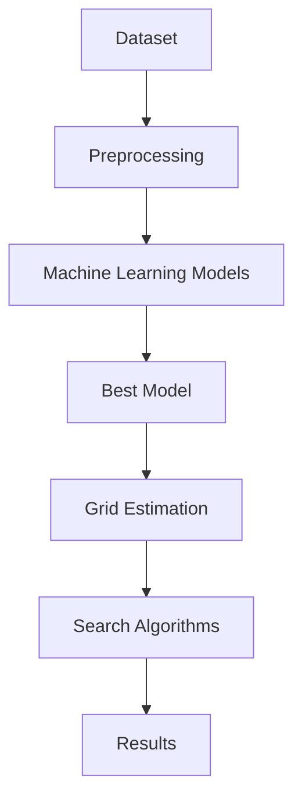

# Artificial Intelligence Assignment Masterplan

## Assignment Overview

## Tasks

| Task | Weighting | Status |
|--------|---------|---------|
| Task 1 | 20% | Complete |
| Task 2 | 40% | Complete |
| Task 3 | 30% | Complete |
| Report | 10% | Complete |

## System Workflow

---

Looking at the rubric screenshot you uploaded, I'd also create a **Rubric Tracker** table inside the checklist:

| Section | Weight | Target | Achieved |
|----------|----------|----------|----------|
| Task 1 | 20 | First | 20 |
| Task 2 | 40 | First | 35 |
| Task 3 | 30 | First | 30 |
| Writing | 10 | First | 8 |
| Total | 100 | First | 93 |

This is particularly useful for your portfolio because it shows not only the work but the outcome.

For the AI module specifically, because I already know the structure from our previous discussions (Task 1 = Problem Analysis, Task 2 = Linear/Polynomial/Neural Network, Task 3 = DFS/BFS/Dijkstra/A*), I can make these files quite comprehensive with:

- Mermaid flowcharts
- Architecture diagrams
- Dataset tables
- Model comparison tables
- Search algorithm comparison tables
- Lessons learned sections
- Portfolio-friendly summaries

So the next thing I would need is:

1. The assignment brief (if you still have it)
2. The final report/notebook you submitted
3. Any code repository (optional)

Then I can build:

- `00-Assignment-Checklist.md`
- `01-Task-1-Problem-Analysis.md`
- `02-Task-2-Machine-Learning-Models.md`
- `03-Task-3-Search-Algorithms.md`
- `04-AI-Masterplan.md`

all in a consistent format ready to drop straight into your GitHub Pages website.
