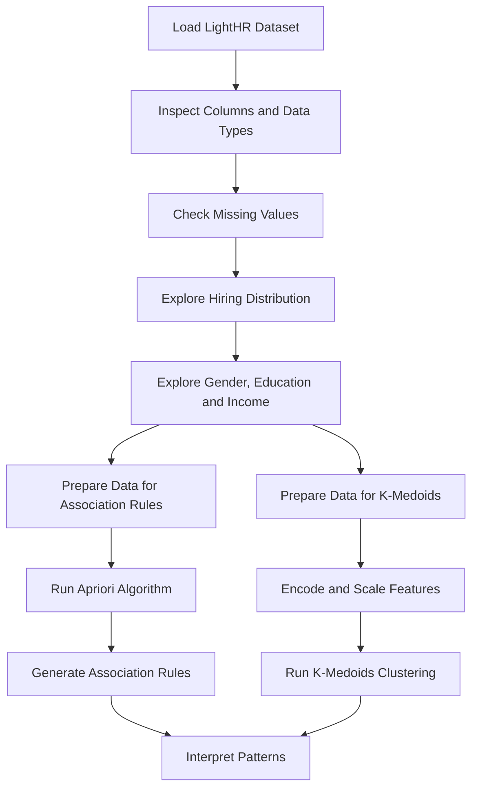
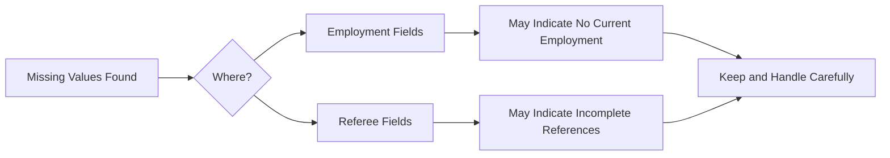
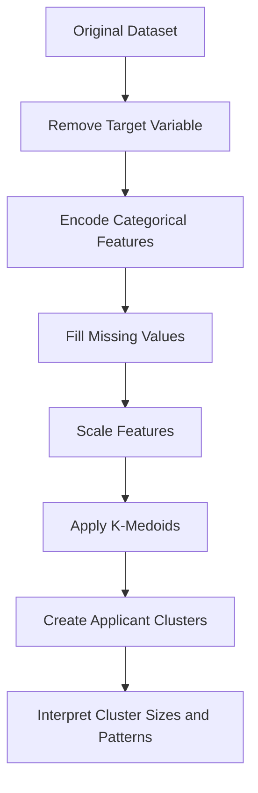

# Task A - Initial Exploration of Data

## Aim

The aim of this task was to explore the LightHR recruitment dataset before building any prediction models. This involved checking the structure of the dataset, identifying missing values, exploring relationships between applicant attributes and hiring outcomes, and applying two lecture-based data mining techniques: association rule mining and K-Medoids clustering.

## Dataset Overview

The LightHR dataset contains applicant information collected from previous resumes. The target variable is whether an applicant was hired by a company within six months.

| Feature Area | Example Attributes |
|---|---|
| Demographics | Gender, age, address |
| Education | A-level score, education type, university name |
| Employment | Current employment, employment sector, income |
| References | References submitted, referee 1, referee 2, referee 3 |
| Target | Was hired within 6 months |

## Initial Exploration Workflow

## Data Quality and Structure

The dataset contains a mixture of numerical and categorical variables. Numerical variables included age, A-level score, and income. Categorical variables included gender, education type, employment status, employment sector, university name, and reference information.

| Data Type | Examples | Why It Matters |
|---|---|---|
| Numerical | Age, A-level score, current income | Used directly by models or grouped for rule mining |
| Categorical | Gender, education, employment sector | Requires encoding before modelling |
| Binary | References submitted, hired within 6 months | Useful for classification and association rules |
| Missing values | Employment and referee fields | May represent incomplete applications rather than random missingness |

## Missing Values

Missing values were mainly found in employment-related and referee-related fields. These missing values were not simply removed because they may contain useful information. For example, missing referee information could indicate an incomplete or weaker application.

## Exploratory Findings

| Area Explored | Main Finding | Relevance |
|---|---|---|
| Hiring distribution | More applicants were rejected than hired | Class imbalance may affect model training |
| Age | Applicants were mainly between 40 and 49 | Age may have limited predictive power |
| Gender vs hiring | Similar but slightly different hiring rates between groups | Needs fairness testing later |
| Education vs hiring | Some education backgrounds may be favoured | Could influence prediction behaviour |
| Income vs hiring | Higher income appeared linked with higher hiring likelihood | May introduce socio-economic bias |

## Association Rule Mining

Association rule mining was used to identify common patterns between applicant attributes and hiring outcomes. Continuous values such as age and income were grouped into categories before applying Apriori.

| Rule Mining Step | Purpose |
|---|---|
| Select relevant features | Reduce noise and focus on useful attributes |
| Group age and income | Convert continuous values into categories |
| One-hot encode categories | Required for Apriori algorithm |
| Generate frequent itemsets | Find common combinations of applicant attributes |
| Generate rules | Identify relationships using support, confidence, and lift |

## Rule Metrics

| Metric | Meaning |
|---|---|
| Support | How frequently a pattern occurs |
| Confidence | How often the rule is true when the condition appears |
| Lift | How much stronger the relationship is compared with chance |

## Association Rule Mining Summary

The association rules suggested that hiring outcomes were not linked to one feature alone. Instead, combinations such as income group, employment status, and reference submission were strongly associated with hiring success. Some rules had confidence values of 1.0, which means they should be interpreted carefully because this may be caused by data imbalance, preprocessing effects, or strong patterns in the data.

## K-Medoids Clustering

K-Medoids clustering was used to group applicants into profiles. It was selected because it uses actual data points as cluster centres, making it more interpretable than some other clustering methods.

## Clustering Summary

| Observation | Interpretation |
|---|---|
| Three clusters were created | The applicant pool contains different candidate profiles |
| One cluster was dominant | Most applicants share similar feature patterns |
| Smaller subgroups existed | Some applicants had distinct employment, income, or reference profiles |
| Clusters overlapped visually | Separation is difficult in two dimensions because the data is multidimensional |

## Task A Conclusion

The initial exploration showed that the LightHR dataset contains useful but potentially sensitive patterns. Hiring outcomes were linked to income, employment status, education, and references. The dataset also showed class imbalance and possible demographic differences, which made later fairness testing important. Association rule mining revealed combinations of features linked with hiring outcomes, while K-Medoids clustering showed that the applicant pool was not uniform.
