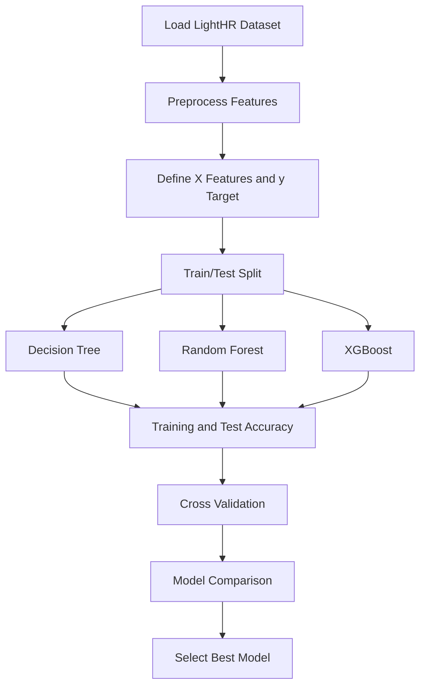
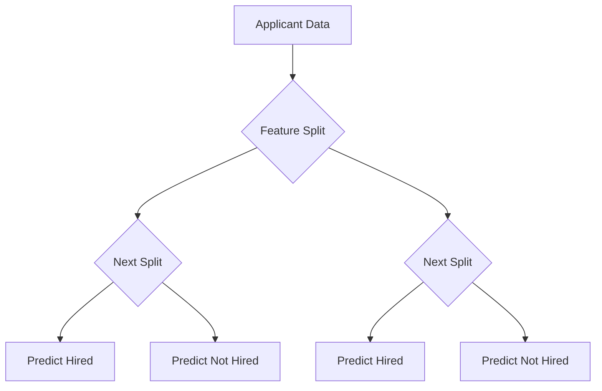
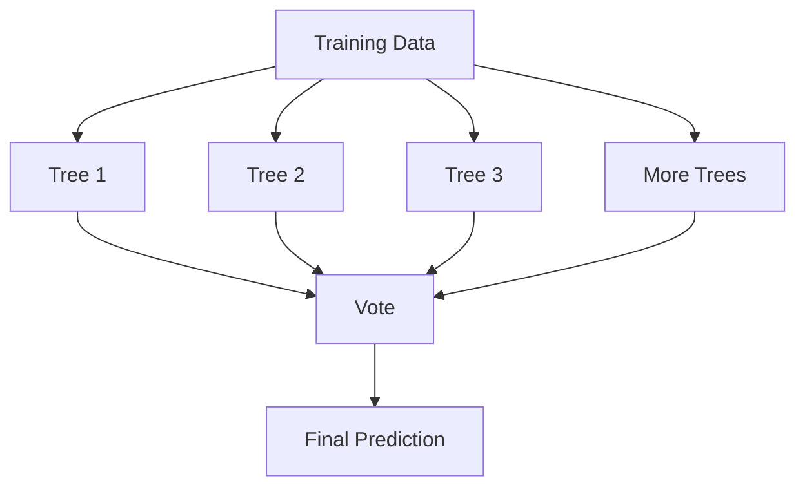
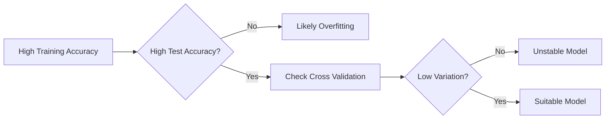

# Task B - Building the Prediction Model

## Aim

The aim of this task was to build and compare classification models that predict whether an applicant would be hired within six months. The models were compared using training accuracy, test accuracy, and cross-validation so that the final model choice was based on both performance and generalisation.

## Modelling Workflow

## Feature and Target Setup

| Item | Description |
|---|---|
| Features | Applicant demographic, education, employment, income, and reference attributes |
| Target | Whether the applicant was hired within six months |
| Split | Training and testing split used to evaluate unseen performance |
| Validation | Cross-validation used to compare model stability |

## Models Explored

| Model | Reason for Use | Main Strength | Main Weakness |
|---|---|---|---|
| Decision Tree | Baseline interpretable classifier | Easy to understand | Can overfit |
| Random Forest | Ensemble of multiple trees | More stable and better generalisation | Less directly interpretable than one tree |
| XGBoost | Advanced gradient boosting model | Strong predictive performance | More sensitive to tuning and complexity |

## Decision Tree

The Decision Tree model recursively splits the dataset based on feature values. It is useful because its structure is easy to interpret, but it can overfit by learning noise in the training data.

## Random Forest

Random Forest was selected as the strongest model in the report. It builds multiple decision trees and combines their predictions. This reduces overfitting and improves model stability compared with a single Decision Tree.

## XGBoost

XGBoost was included as a more advanced ensemble technique. It builds trees sequentially, where each new tree attempts to correct the errors of previous trees. Although it can perform strongly, it is more sensitive to tuning and complexity.

## Evaluation Approach

| Evaluation Method | Purpose |
|---|---|
| Training accuracy | Shows how well the model fits training data |
| Test accuracy | Shows how well the model generalises to unseen data |
| Cross-validation mean | Gives a more reliable average performance score |
| Cross-validation standard deviation | Shows how stable the model is across folds |
| Confusion matrix | Shows true positives, false positives, true negatives, and false negatives |

## Model Comparison Logic

## Model Selection

The Random Forest model was selected as the best model because it gave a stronger balance between predictive performance, generalisation, and stability. The Decision Tree was easier to interpret but more prone to overfitting. XGBoost was competitive, but its additional complexity and sensitivity to tuning made Random Forest more suitable for the final explainability and fairness stages.

## Task B Conclusion

Several classification models were explored, including Decision Tree, Random Forest, and XGBoost. The model comparison considered both direct accuracy and cross-validation. Random Forest was chosen as the final model because it reduced overfitting compared with the Decision Tree and provided a more stable model for later SHAP, LIME, and fairness testing.
