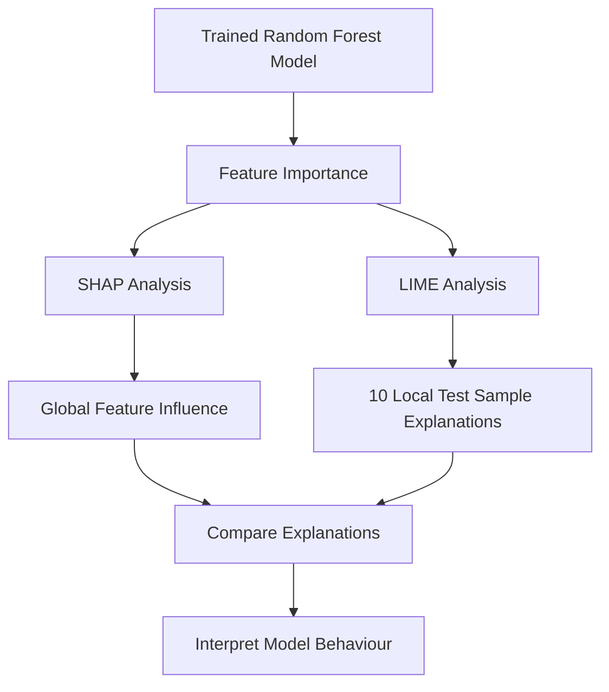
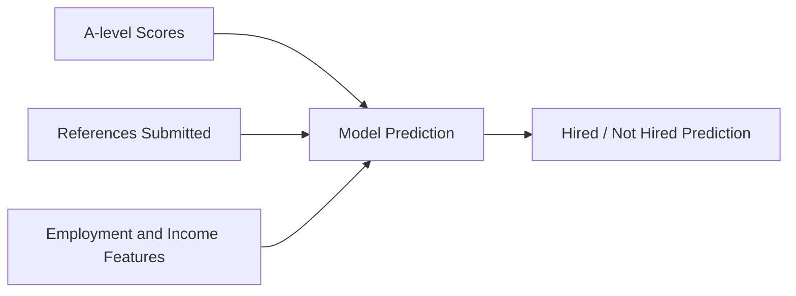
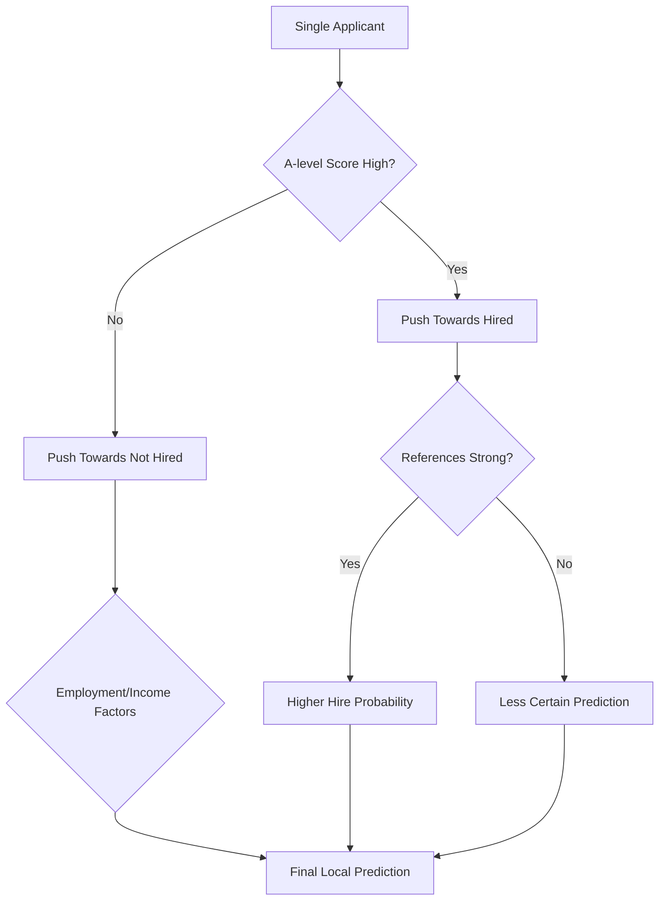

# Task C - Explainability Analysis

## Aim

The aim of this task was to explain how the final machine learning model made predictions. Explainability was important because the model was being used in a recruitment context, where predictions should be transparent and justifiable.

The analysis used two explainability methods:

| Method | Type | Purpose |
|---|---|---|
| SHAP | Global and local explanation | Shows which features influence the model overall |
| LIME | Local explanation | Explains individual predictions for selected test samples |

## Explainability Workflow

## Feature Importance

The Random Forest feature importance scores were used as the first layer of interpretability. This helped identify which applicant attributes had the strongest influence on predictions.

## SHAP Analysis

SHAP was used to explain the global behaviour of the model. The SHAP bee-swarm and feature importance plots showed how features affected hiring predictions across the dataset.

| SHAP Finding | Interpretation |
|---|---|
| A-level scores were highly influential | Academic performance strongly affected model predictions |
| Reference-related features were important | Supporting evidence helped increase positive hiring predictions |
| Lower A-level score bands reduced hiring likelihood | Lower academic performance had a negative model impact |
| Some employment and income categories affected predictions | Socio-economic variables influenced model decisions |

## SHAP Summary

## LIME Analysis

LIME was used to explain individual model predictions. The assignment required LIME analysis on 10 selected test records. Each explanation showed which features pushed an individual prediction towards either hired or not hired.

## LIME Summary Table

| Sample Pattern | Main Positive Factors | Main Negative Factors | Interpretation |
|---|---|---|---|
| Strong hire prediction | High A-level score, references submitted | Some employment or income categories | Academic and reference strength pushed prediction positive |
| Strong rejection prediction | References submitted in some cases | Low A-level score, weak reference profile | Low academic score could outweigh positive evidence |
| Mixed case | High A-level score | Employment, income, or referee features | Model could still reject where other features were negative |

## Example Local Explanation Logic

## SHAP vs LIME

| Comparison Area | SHAP | LIME |
|---|---|---|
| Scope | Global and local | Mainly local |
| Use in project | Explained overall model behaviour | Explained 10 individual test records |
| Main finding | A-level scores and references were influential | Same pattern appeared in individual predictions |
| Strength | Consistent overview of feature importance | Easier to explain one applicant at a time |
| Limitation | Can be harder to interpret with encoded categorical features | Local approximations may vary between samples |

## Explainability Limitation

Some categorical variables, such as university and address, were encoded numerically. These categories do not naturally have an ordered meaning, so this can reduce interpretability in SHAP and LIME outputs. This means that some explanations should be treated carefully, especially where encoded categories appear as important features.

## Task C Conclusion

SHAP and LIME both showed that the model relied heavily on A-level scores, reference information, and employment/income-related features. The agreement between SHAP's global explanations and LIME's local explanations increased confidence that the model was behaving consistently. However, the use of encoded categorical features limited how clearly some model decisions could be interpreted.
