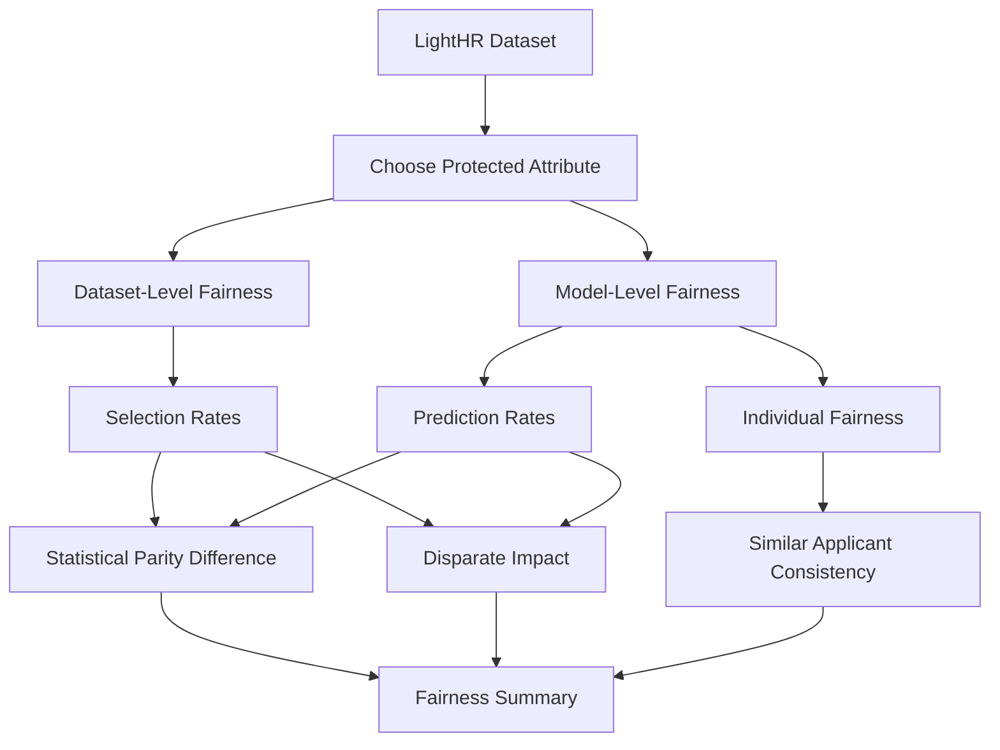
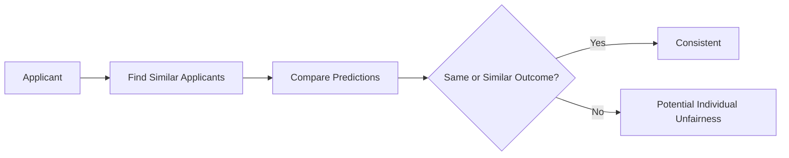

# Task D - Fairness Testing

## Aim

The aim of this task was to evaluate fairness in both the LightHR dataset and the trained prediction model. This was important because the model was applied to recruitment data, where unfair patterns could disadvantage particular applicant groups.

The fairness analysis considered both group fairness and individual fairness.

| Fairness Type | Meaning |
|---|---|
| Group fairness | Checks whether different demographic groups receive similar outcomes |
| Individual fairness | Checks whether similar applicants receive similar predictions |

## Fairness Testing Workflow

## Protected Attribute

The main protected attribute used in the fairness summary was gender. The privileged group was compared against unprivileged groups to evaluate whether selection and prediction rates were balanced.

## Group Fairness Metrics

| Metric | Meaning | Target Range |
|---|---|---|
| Selection rate | Proportion of a group with positive outcomes | Used for comparison |
| Statistical Parity Difference | Difference between unprivileged and privileged selection rates | Close to 0, usually between -0.1 and 0.1 |
| Disparate Impact | Ratio of unprivileged to privileged selection rates | At least 0.8 |

## Fairness Summary Results

| Fairness Metric | Value | Acceptable Range | Status |
|---|---:|---|---|
| Privileged Group Selection Rate Dataset | 0.2697 | N/A | N/A |
| Unprivileged Groups Selection Rate Dataset | 0.2315 | N/A | N/A |
| Statistical Parity Difference Dataset | -0.0382 | -0.1 to 0.1 | Fair |
| Disparate Impact Dataset | 0.8585 | >= 0.8 | Fair |
| Privileged Group Prediction Rate Model | 0.2597 | N/A | N/A |
| Unprivileged Groups Prediction Rate Model | 0.2345 | N/A | N/A |
| Statistical Parity Difference Model | -0.0253 | -0.1 to 0.1 | Fair |
| Disparate Impact Model | 0.9028 | >= 0.8 | Fair |
| Individual Fairness Score | 0.9277 | >= 0.8 | Fair |
| Individual Consistency Rate | 92.77% | >= 80% | Fair |

## Dataset-Level Fairness

The dataset-level fairness results showed that the privileged group had a selection rate of 0.2697, while the unprivileged groups had a selection rate of 0.2315. The Statistical Parity Difference was -0.0382, which falls within the acceptable range of -0.1 to 0.1. The Disparate Impact was 0.8585, which is above the 0.8 threshold.

This suggests that the dataset showed some difference between groups, but the measured disparity was within the accepted fairness thresholds used in the analysis.

## Model-Level Fairness

The model-level fairness results showed that the privileged group had a prediction rate of 0.2597, while the unprivileged groups had a prediction rate of 0.2345. The model's Statistical Parity Difference was -0.0253, and the Disparate Impact was 0.9028.

Compared with the dataset-level results, the model-level metrics were slightly closer to fairness thresholds. This suggests that the Random Forest model did not amplify the measured gender disparity and may have slightly reduced it according to these metrics.

## Individual Fairness

Individual fairness was measured by checking whether similar applicants received similar predictions. The individual fairness score was 0.9277, with a consistency rate of 92.77%. This was above the 80% threshold used in the analysis.

## Fairness Interpretation

| Area | Interpretation |
|---|---|
| Dataset fairness | Some group difference existed, but SPD and DI were within accepted thresholds |
| Model fairness | The model did not appear to amplify the measured gender disparity |
| Individual fairness | Similar applicants usually received similar predictions |
| Main risk | Other variables such as income, education, references, and employment may still act as indirect bias routes |

## Task D Conclusion

The fairness testing showed that the dataset and model were within the selected fairness thresholds for gender-based group fairness. The model had a Statistical Parity Difference of -0.0253 and Disparate Impact of 0.9028, both of which were acceptable under the chosen criteria. The individual consistency rate of 92.77% also suggested that similar applicants usually received similar predictions. However, the analysis still highlighted the need to treat recruitment models carefully because socio-economic and employment-related features can still introduce indirect bias.
