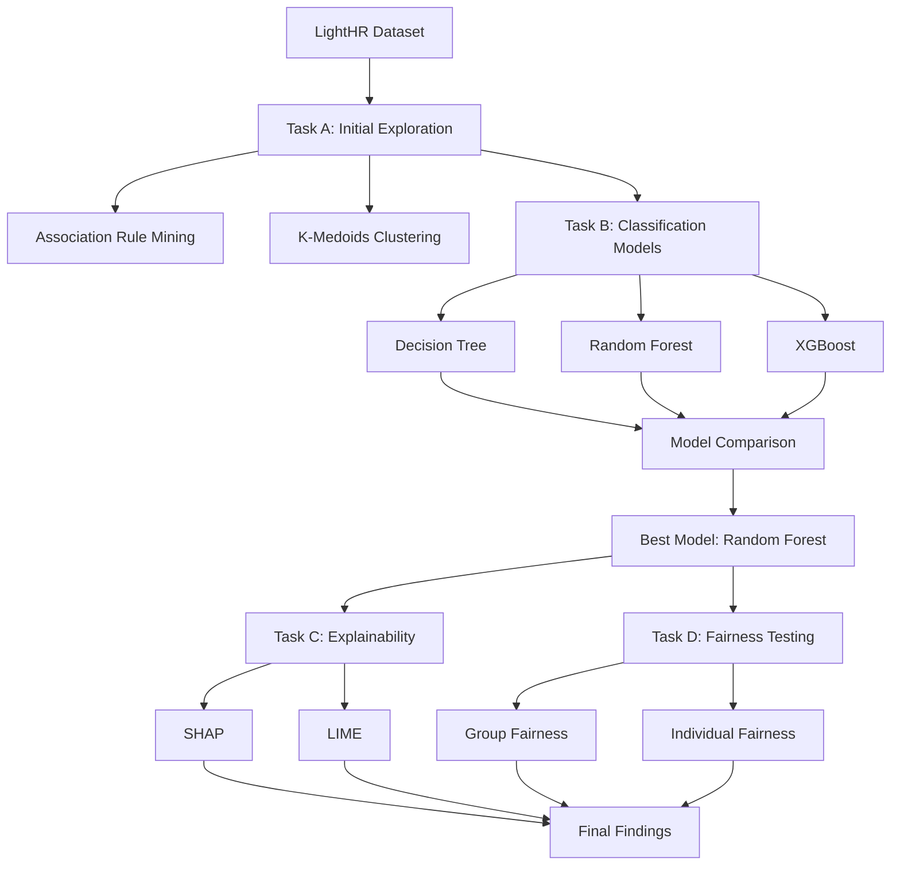

# Data Analysis and Visualisation Masterplan

## Project Overview

This project focused on the LightHR recruitment dataset. The overall aim was to explore applicant data, build a hiring prediction model, explain the model's behaviour, and test whether the data and model showed signs of unfairness.

## Project Structure

| File | Purpose |
|---|---|
| `00-Assignment-Checklist.md` | Tracks assignment requirements and rubric coverage |
| `01-Task-A-Initial-Exploration.md` | Covers data exploration, association rule mining, and K-Medoids |
| `02-Task-B-Prediction-Models.md` | Covers Decision Tree, Random Forest, XGBoost, and model selection |
| `03-Task-C-Explainability.md` | Covers SHAP and LIME explainability analysis |
| `04-Task-D-Fairness-Testing.md` | Covers group and individual fairness testing |
| `05-Data-Analysis-Masterplan.md` | Provides the complete project overview |

## Assignment Pipeline

## Dataset Attributes

| Category | Attributes |
|---|---|
| Demographic | Gender, age, address |
| Academic | A-level score, education, university name |
| Employment | Current employment, employment sector, current annual income |
| References | References submitted, referee 1, referee 2, referee 3 |
| Target | Was hired by a company within 6 months |

## Main Techniques Used

| Area | Techniques |
|---|---|
| Exploration | Missing value analysis, visualisation, class distribution analysis |
| Pattern mining | Apriori association rule mining |
| Clustering | K-Medoids clustering |
| Classification | Decision Tree, Random Forest, XGBoost |
| Validation | Train/test split, cross-validation, confusion matrix |
| Explainability | SHAP, LIME |
| Fairness | Statistical Parity Difference, Disparate Impact, individual consistency |

## Key Findings

| Area | Finding |
|---|---|
| Data exploration | The dataset contained class imbalance and missing employment/reference information |
| Association rules | Income, employment, and reference features appeared strongly linked with hiring outcomes |
| Clustering | Applicants formed multiple profiles, including one dominant group and smaller subgroups |
| Model comparison | Random Forest provided the best balance of performance and stability |
| Explainability | A-level scores and references were major drivers of prediction behaviour |
| Fairness | Gender-based group fairness metrics were within the selected acceptable thresholds |
| Individual fairness | Similar applicants received similar predictions in 92.77% of cases |

## Final Model Choice

Random Forest was selected as the final model because it provided a good balance between performance and generalisation. It reduced overfitting compared with a single Decision Tree and was less complex to justify than XGBoost.

## Fairness Summary

| Metric | Dataset | Model |
|---|---:|---:|
| Statistical Parity Difference | -0.0382 | -0.0253 |
| Disparate Impact | 0.8585 | 0.9028 |

The model did not appear to amplify the measured gender disparity. The model-level fairness metrics were slightly better than the dataset-level metrics under the selected thresholds.

## Final Reflection

This project showed the importance of combining technical model performance with explainability and fairness analysis. In a recruitment setting, accuracy alone is not enough. A model should also be understandable, stable, and checked for potential bias. The final analysis showed that Random Forest was a suitable model for this dataset, but socio-economic variables such as income, employment, and references still need careful handling because they may create indirect bias.
