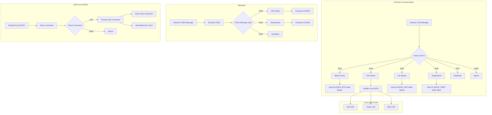

The Arduino Uno is responsible for all **low-level hardware communication and control** in this assignment.

It must act as the **central controller for CAN bus, Bluetooth, and local hardware**, and forward processed data to the ESP32.

This document outlines exactly what you need to implement on the Arduino Uno.

---

# 1. Core Responsibilities

Must implement the following on the Arduino Uno:

* CAN bus communication (send + receive)
* Bluetooth communication (COBS encoded serial)
* Local LED control (Red, Green, Blue)
* UART communication with ESP32
* Message parsing and routing
* Heartbeat generation

---

# 2. Hardware Setup

Must connect:

* MCP2515 CAN module (SPI)
* Bluetooth module (UART / SoftwareSerial)
* 3 LEDs (Red, Green, Blue)
* UART connection to ESP32

## Important:

* Use a **voltage divider** on Arduino TX → ESP32 RX
* Ensure common ground between all components

---

# 3. CAN Bus Implementation

## 3.1 Receive Messages

You must detect and handle these CAN IDs:

* 0x10 → Button press
* 0x20 → LED status
* 0x30 → Fan speed
* 0x40 → Temperature
* 0xF0 → Heartbeat

## 3.2 What You Must Do

For each message:

### Button (0x10)

* Extract Node ID and Button ID
* Send to ESP32 via UART:

  * Example: `BTN 2 3 PRESSED`

### LED Status (0x20)

* Extract LED states
* (Optional) forward to ESP32

### Fan Speed (0x30)

* Combine MSB + LSB into 16-bit integer
* Send to ESP32:

  * Example: `SPD 5 120`

### Temperature (0x40)

* Combine MSB + LSB (signed 16-bit)
* Divide by 10 to get actual value
* Send to ESP32:

  * Example: `TEMP 3 23.5`

### Heartbeat (0xF0)

* Track active nodes (optional but recommended)

---

## 3.3 Send Messages

You must be able to send:

* 0x21 → Set single LED
* 0x22 → Set multiple LEDs
* 0x31 → Set fan speed
* 0xF0 → Heartbeat

## Example:

* Receive command from ESP32:

  * `LED RED ON`
* Convert into CAN message 0x21

---

## 3.4 Important Rules

* Ignore unknown CAN IDs
* Handle Target ID = 0 (broadcast)
* Maintain heartbeat timing (1–5 Hz)

---

# 4. Bluetooth Implementation

## 4.1 Requirements

You must:

* Decode incoming COBS messages
* Encode outgoing COBS messages
* Handle message types:

  * 0x23 → LED status
  * 0x40 → Temperature
  * 0xF0 → Heartbeat

---

## 4.2 What You Must Do

### Receive:

* Decode message
* Extract values
* Forward important data to ESP32

### Send:

* Send LED control (0x24)
* Send heartbeat

---

## 4.3 Important Rules

* Messages are **zero-byte (0x00) delimited**
* Validate message length
* Ignore invalid messages

---

# 5. Local LED Control

You must control 3 LEDs:

* Red
* Green
* Blue

## Behaviour:

* Respond to CAN messages (0x21, 0x22)
* Respond to ESP32 commands
* Update immediately

---

# 6. UART Communication (Arduino ↔ ESP32)

## 6.1 You Must Implement

* Serial communication (prefer hardware serial)
* Message parsing
* Message formatting

## 6.2 Example Messages

Send to ESP32:

* `TEMP 3 23.5`
* `SPD 5 120`
* `BTN 2 3 PRESSED`

Receive from ESP32:

* `LED RED ON`
* `LED GREEN OFF`

---

## 6.3 Important Rules

* Keep messages simple and consistent
* Avoid blocking serial reads
* Validate incoming commands

---

# 7. Heartbeat System

You must send CAN heartbeat messages:

* ID: 0xF0
* Frequency: 1–5 times per second

You must:

* Maintain a counter
* Increment each message
* Reset after 65535

---

# 8. Main Loop Structure

Your loop should:

1. Check CAN messages
2. Check Bluetooth messages
3. Check UART (ESP32 messages)
4. Update LEDs
5. Send heartbeat (timed)

## Important:

* Use `millis()` instead of `delay()`
* Keep loop non-blocking

---

# 9. Robustness Requirements

Your Arduino must:

* Not crash if CAN is inactive
* Not crash if Bluetooth disconnects
* Ignore malformed messages
* Continue running at all times

---

# 10. Final Checklist

* [x] CAN receive working
* [x] CAN send working
* [ ] Bluetooth decode (COBS) working
* [ ] Bluetooth send working
* [x] UART communication working
* [x] LEDs respond correctly
* [ ] Heartbeat implemented correctly
* [x] No blocking code
* [ ] System stable under failure conditions

---

# 11. Proposed Work Out

---

# Summary

The Arduino Uno acts as the **core hardware controller** of the system.

It must:

* Interface with CAN and Bluetooth
* Process and interpret messages correctly
* Control local hardware
* Communicate reliably with the ESP32

Focus on correctness, reliability, and clean message handling.

---
