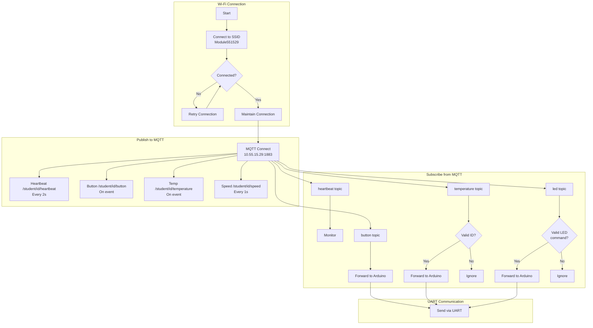

---

# 1. Overview

The FireBeetle ESP32 is responsible for all **network communication** in this system.

It acts as a bridge between:
- Arduino Uno (local system)
- MQTT server (IoT network)

It must:
- Send data to MQTT
- Receive commands from MQTT
- Forward data to/from Arduino via UART
- Maintain reliable network connectivity

---

# 2. Core Responsibilities

You must implement:

- Wi-Fi connection management
- MQTT client (publish + subscribe)
- UART communication with Arduino
- Message parsing (incoming + outgoing)
- LED synchronisation with Arduino
- Network heartbeat system

---

# 3. Wi-Fi Implementation

### Requirements

- Connect to lab network:
  - SSID: `Module551529`
  - Password: (provided in lab)

### You must:

- Connect on startup
- Detect disconnection
- Automatically reconnect

### Checklist

- [x] Wi-Fi connects successfully  
- [x] Wi-Fi reconnects after failure  
- [x] Connection status visible (serial debug recommended)  

---

# 4. MQTT Implementation

### Server Details
Lab:
- IP: `10.55.15.29` 
- Port: `1883`

Home:
- IP: `172.16.8.16 ` (may vary)
- Port `1883`

---

## 4.1 MQTT Connection

You must:

- Connect to broker on startup
- Reconnect if disconnected
- Maintain stable connection

---

## 4.2 Publish Topics (MANDATORY)

You MUST publish EXACTLY these:

#### Heartbeat

- Topic: `/student/<id>/heartbeat`
- Frequency: every 2 seconds
- Data: integer counter

Example:
123

---

#### Button

- Topic: `/student/<id>/button`
- Trigger: when event received from Arduino

Example:
2 3 pressed

---

#### Temperature

- Topic: `/student/<id>/temperature`
- Trigger: when received from Arduino

Example:
3 23.5

---

#### Speed

- Topic: `/student/<id>/speed`
- Frequency: every 1 second

Example:
5 120

---

### Rules

- No quotation marks in messages  
- Space-separated values only  
- Exact formatting required  

---

## 4.3 Subscribe Topics (MANDATORY)

You must subscribe to:

- `/heartbeat`
- `/button`
- `/temperature`
- `/led`

---

## 4.4 Message Handling

#### /heartbeat

- Receive value  
- (Optional) use for monitoring  

---

#### /button

- Receive button ID and state  
- Forward to Arduino if required  

---

#### /temperature

Format:
<targetID> <temperature>
Example:
12 23.5

You must:

- Check if:
  - targetID == your system ID  
  - OR targetID == 0 (broadcast)  
- Forward valid commands to Arduino  

---

#### /led

Format:
<targetID> <colour> <state>

Example:

135 red ON

Convert to UART command:
LED RED ON

You must:

- Validate target ID  
- Validate colour (red/green/blue)  
- Validate state (ON/OFF)  
- Send to Arduino  

---

### Rules

- Ignore messages not for your system  
- Ignore malformed messages  
- Do not crash on bad input  

---

# 5. UART Communication (ESP32 ↔ Arduino)

### You must:

- Receive messages from Arduino  
- Parse messages  
- Send commands to Arduino  

---

## 5.1 Receive (from Arduino)

Examples:
TEMP 3 23.5
SPD 5 120
BTN 2 3 PRESSED

You must:

- Parse message type  
- Extract values  
- Publish to MQTT  

---

## 5.2 Send (to Arduino)

Examples:
LED RED ON
LED GREEN OFF

---

### Rules

- Keep messages simple  
- Use consistent format  
- Avoid blocking reads  

---

# 6. LED Synchronisation

You must:

- Mirror Arduino LED states on ESP32 LEDs  

### You must:

- Receive LED updates from Arduino  
- Update ESP32 LEDs immediately  

---

# 7. Heartbeat System

### MQTT Heartbeat

- Send every 2 seconds  
- Increment counter  
- Reset after 65535  

---

### Requirements

- Must be consistent timing  
- Must not block system  

---

## 8. Main Loop Structure

Your loop should:

1. Maintain Wi-Fi connection  
2. Maintain MQTT connection  
3. Handle incoming MQTT messages  
4. Handle UART messages from Arduino  
5. Publish scheduled messages  

---

### IMPORTANT

- Use `millis()` (no delay)  
- Keep loop non-blocking  

---

# 9. Robustness Requirements

Your ESP32 must:

- Reconnect Wi-Fi automatically  
- Reconnect MQTT automatically  
- Not crash on invalid MQTT messages  
- Not crash if Arduino disconnects  
- Continue running under all conditions  

---

# 10. Final Checklist

### Wi-Fi

- [x] Connects successfully  
- [ ] Reconnects automatically  

### MQTT

- [x] Connects to broker  
- [x] Reconnects automatically  

#### Publish

- [x] Heartbeat correct (2s)  
- [x] Button messages correct  
- [x] Temperature messages correct  
- [x] Speed messages correct (1s)  

#### Subscribe

- [x] /heartbeat handled  
- [x] /button handled  
- [x] /temperature handled  
- [x] /led handled  
- [x] Invalid MQTT messages ignored  

---

### UART

- [x] Receives Arduino messages correctly  
- [x] Sends commands to Arduino correctly  
- [ ] Parsing works reliably  

---

### LEDs

- [x] ESP32 LEDs match Arduino LEDs  

---

### Timing

- [x] No blocking code  
- [x] Correct publish intervals  

---

### System

- [x] Full communication path works  
- [x] System stable under failure conditions  

---

# 10. Proposed Work Out

---

## Summary

The ESP32 is responsible for all networking and must:

- Handle MQTT correctly  
- Translate between UART and MQTT  
- Maintain stable connections  
- Ensure correct formatting of all messages  

Focus on correctness, timing, and robustness.

---
