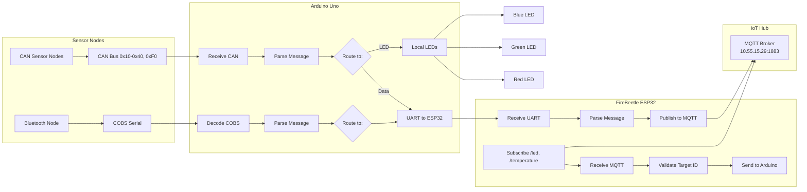

---

# 1. Overview

This project involves designing and implementing an **IoT node system** using:

* Arduino Uno (local hardware + communication)
* FireBeetle ESP32 (network + MQTT communication)

The system must:

* Communicate with **sensor nodes via CAN bus**
* Communicate with **a Bluetooth node (COBS encoded serial)**
* Communicate with an **IoT hub using MQTT over Wi-Fi**
* Provide **local LED indicators**
* Maintain **robust, real-time communication**

---

# 2. System Architecture

## Core Components

### Arduino Uno

Responsible for:

* CAN bus communication (MCP2515)
* Bluetooth communication (COBS serial)
* Local LED control (Red, Green, Blue)
* UART communication with ESP32
* Message parsing and routing
* Heartbeat generation

---

### FireBeetle ESP32

Responsible for:

* Wi-Fi connectivity
* MQTT communication (publish + subscribe)
* UART communication with Arduino
* Message translation (UART ↔ MQTT)
* LED synchronisation
* Network heartbeat

---

### External Components

* CAN sensor nodes (multiple)
* Bluetooth sensor node (single active)
* IoT Hub (MQTT broker)
* Optional Node-RED dashboard (development + demonstration)

---

# 3. Communication Flow

## Sensor → Cloud

1. Sensor node sends data via CAN or Bluetooth
2. Arduino receives and decodes message
3. Arduino sends formatted message via UART
4. ESP32 receives and parses message
5. ESP32 publishes to MQTT topic

---

## Cloud → System

1. MQTT message received by ESP32
2. ESP32 validates target ID
3. ESP32 sends command via UART
4. Arduino processes command
5. Arduino updates:

   * LEDs
   * CAN nodes
   * Bluetooth node

---

# 4. Communication Protocols

## CAN Bus

* Standard 8-byte messages
* Handles:

  * Button (0x10)
  * LED status (0x20)
  * Speed (0x30)
  * Temperature (0x40)
  * Heartbeat (0xF0)

---

## Bluetooth (COBS)

* Byte-stuffed serial protocol
* Zero-delimited messages
* Includes:

  * LED status
  * Temperature
  * Heartbeat

---

## UART (Arduino ↔ ESP32)

* Plain text protocol
* Space-separated messages
* Newline-terminated

### Example:

TEMP 3 23.5
SPD 5 120
BTN 2 3 PRESSED
LED RED ON

---

## MQTT

### Publish:

* `/student/<id>/heartbeat`
* `/student/<id>/button`
* `/student/<id>/temperature`
* `/student/<id>/speed`

### Subscribe:

* `/heartbeat`
* `/button`
* `/temperature`
* `/led`

---

# 5. Hardware Design

## Required Components

* Arduino Uno
* FireBeetle ESP32
* MCP2515 CAN module
* Bluetooth module
* 3 LEDs (Red, Green, Blue)
* Resistors
* Voltage divider (IMPORTANT)

---

## Critical Constraint

* Arduino = 5V logic
* ESP32 = 3.3V logic

### Solution:

* Use voltage divider:
  Arduino TX → ESP32 RX

---

# 6. Software Architecture

## Design Approach

Modular structure using:

* `.ino` → main loop + setup
* `.h/.cpp` → subsystem handlers

---

## Example Modules

### Arduino:

* CAN_Handler
* Bluetooth_Handler
* UART_Handler
* LED_Handler
* Heartbeat_Manager

### ESP32:

* WiFi_Handler
* MQTT_Handler
* UART_Handler
* LED_Handler

---

## Main Loop Philosophy

* Non-blocking (`millis()`)
* Event-driven
* Continuous polling

---

# 7. Development Strategy

## Step 1 (Lab Priority)

* Get MQTT working on lab network
* Verify publish/subscribe functionality

---

## Step 2 (Core System)

* Implement UART communication
* Connect Arduino ↔ ESP32
* Validate message passing

---

## Step 3 (Hardware Integration)

* Add CAN bus
* Add Bluetooth
* Add LED control

---

## Step 4 (Full System)

* End-to-end data flow working:
  CAN → MQTT
  MQTT → LED/CAN

---

## Step 5 (Home Development)

* Use Node-RED:

  * Simulate MQTT broker
  * Visualise data
  * Build UI dashboard

---

# 8. Demonstration Plan

* Use Node-RED dashboard on tablet
* Show:

  * Button events
  * Temperature updates
  * Fan speed data
  * LED control

---

# 9. Robustness Requirements

System must:

* Reconnect Wi-Fi automatically
* Reconnect MQTT automatically
* Handle CAN inactivity
* Handle Bluetooth disconnection
* Ignore invalid messages
* Never crash

---

# 10. Security Considerations

* MQTT is unencrypted → risk of interception
* No authentication → risk of spoofed commands
* UART is unprotected → risk of injection
* CAN is broadcast → all nodes can see messages

Mitigation:

* Validate all inputs
* Check target IDs
* Ignore malformed messages
* Restrict command formats

---

# 11. Key Goal

Build a **robust, modular IoT system** that:

* Correctly processes all required protocols
* Maintains stable communication
* Demonstrates full system integration
* Meets all rubric requirements

---

# 12 Proposed Work Out

