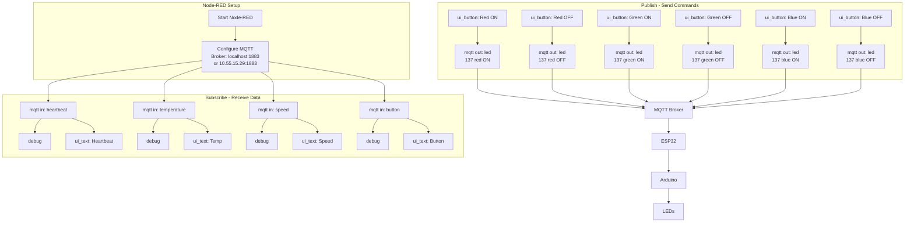

---

# 1. Purpose

Node-RED is used as a **local testing, monitoring, and control interface** for the IoT system.

It allows:

* Visualisation of MQTT data (heartbeat, temperature, etc.)
* Sending control commands (e.g. LED control)
* Testing system behaviour without relying on the lab environment

Node-RED acts as an **MQTT client**, not a replacement for the MQTT broker.

---

# 2. System Role

Node-RED fits into the system as follows:

```
Node-RED ⇄ MQTT Broker ⇄ ESP32 ⇄ Arduino Uno
```

* Node-RED publishes and subscribes to MQTT topics
* ESP32 handles MQTT communication and translates messages to/from UART
* Arduino Uno handles hardware control

---

# 3. MQTT Configuration

## Local Development (Home Setup)

* Broker: `localhost`
* Port: `1883`
* Username: *(none)*
* Password: *(none)*
* TLS: disabled

## Lab Setup (Later)

* Broker: `10.55.15.29`
* Port: `1883`
* Username: *(none)*
* Password: *(none)*

Only the **broker address changes** between environments.

---

# 4. Topics Used

## Subscribe (Node-RED receives data)

```
/student/202323817/heartbeat
/student/202323817/temperature
/student/202323817/speed
/student/202323817/button
```

## Publish (Node-RED sends commands)

```
/led
```

---

# 5. Node-RED Flow Design

## 5.1 Heartbeat Monitoring

### Nodes:

* `mqtt in`
* `debug`
* `ui_text`

### Configuration:

* Topic: `/student/202323817/heartbeat`

### Flow:

```
[mqtt in] → [debug]
         → [ui_text]
```

### Purpose:

* Displays system heartbeat
* Confirms ESP32 → MQTT → Node-RED communication

---

## 5.2 LED Control Interface

### Nodes:

* `ui_button`
* `mqtt out`

### MQTT Topic:

```
/led
```

### Example Payloads:

```
137 red ON
137 red OFF
137 green ON
137 green OFF
137 blue ON
137 blue OFF
```

### Flow:

```
[ui_button] → [mqtt out]
```

### Purpose:

* Allows user to send control commands
* Tests Node-RED → MQTT → ESP32 path

---

## 5.3 Debug Output (Recommended)

### Nodes:

* `debug`

### Use:

* Connected to both:

  * `mqtt in`
  * `ui_button`

### Purpose:

* Verifies message format
* Helps debugging during development

---

# 6. Dashboard Layout

## Group 1: System Status

* Heartbeat display (`ui_text`)

## Group 2: LED Controls

* Red ON / OFF
* Green ON / OFF
* Blue ON / OFF

Access dashboard via:

```
http://localhost:1880/ui
```

```

heartbeat mqtt in    → debug + ui_text
temperature mqtt in  → debug + ui_text
speed mqtt in        → debug + ui_text
button mqtt in       → debug + ui_text

Red ON button        → mqtt out (/led)
```
---

# 7. Message Format Requirements

## LED Control Messages

Format:

```
<targetID> <colour> <state>
```

Example:

```
137 red ON
```

### Rules:

* No commas
* No quotation marks
* Space-separated only
* Colour must be:

  * red
  * green
  * blue
* State must be:

  * ON
  * OFF

---

# 8. System Behaviour

## Control Flow

```
Node-RED button
→ MQTT publish (/led)
→ ESP32 receives
→ ESP32 validates target ID
→ ESP32 forwards to Arduino (UART)
→ Arduino updates LEDs
```

## Monitoring Flow

```
Arduino → ESP32 (UART)
→ ESP32 publishes MQTT
→ Node-RED receives
→ Dashboard displays data
```

---

# 9. Key Design Notes

* Node-RED does NOT communicate directly with Arduino
* ESP32 acts as the bridge between MQTT and hardware
* Topic structure matches assignment requirements
* Same flows work for both:

  * local testing
  * lab environment

---

# 10. Development Strategy

1. Build heartbeat monitor first
2. Add one LED control button
3. Verify MQTT communication
4. Expand to full LED control panel
5. Add additional data displays (temperature, speed)

---

# 11. Outcome

This setup provides:

* A complete MQTT testing environment
* A visual debugging interface
* A demonstration-ready dashboard
* A reusable structure for final system integration

---

# 12. Proposed Work Out


