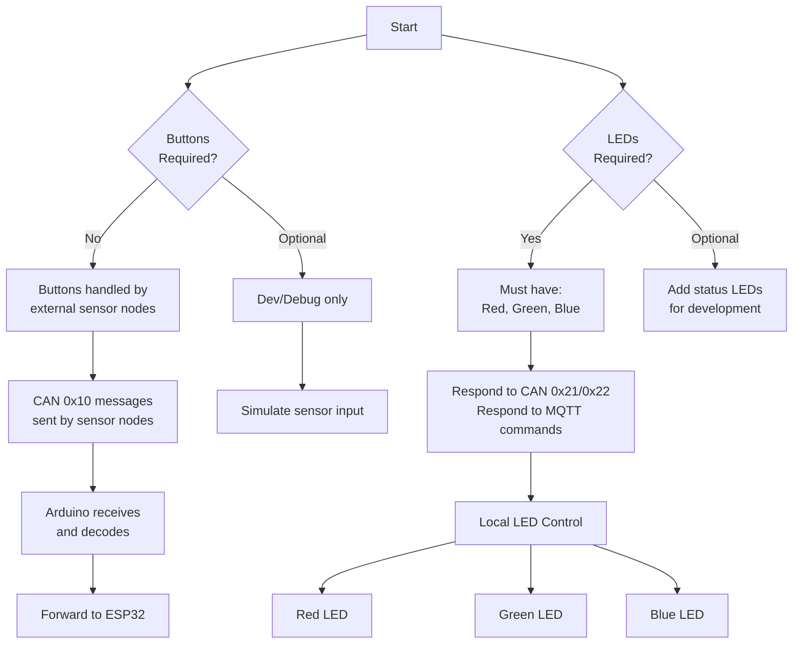

---

# 1. Overview

This document explains:

* Whether buttons are required
* Whether LEDs are required
* How LEDs should be used
* Optional design improvements using additional LEDs or buttons
* Justification for including or excluding them in the system

---

# 2. Buttons

## 2.1 Are Buttons Required?

Buttons are **NOT required** for this assignment.

Reason:

* Button inputs are already handled by **external sensor nodes**
* These nodes send **CAN (0x10) button messages**
* Your system only needs to **receive and process these messages**

---

## 2.2 What Buttons Do in the System

Buttons exist on:

* CAN sensor nodes
* Bluetooth sensor node

When pressed, they generate messages such as:

```text
CAN ID: 0x10
D0: Node ID
D1: Button ID
```

Your Arduino must:

* Receive the message
* Decode it
* Forward it to the ESP32

---

## 2.3 When You Might Add Buttons

Buttons can be added **optionally** for development purposes.

### Valid uses:

* Simulate sensor node input (test mode)
* Trigger test messages
* Debug system behaviour

### Example:

```text
BTN 1 0 PRESSED
```

---

## 2.4 Recommendation

* Do NOT include buttons in final design unless needed
* Only use them for testing or debugging

---

# 3. LEDs

## 3.1 Are LEDs Required?

YES — LEDs are **mandatory**.

The system must include:

* 1 × Red LED
* 1 × Green LED
* 1 × Blue LED

---

## 3.2 Required Behaviour

The LEDs must:

* Respond to CAN messages (0x21 and 0x22)
* Respond to MQTT commands (via ESP32)
* Be controlled externally

---

## 3.3 What LEDs Represent

The LEDs act as:

* Output devices
* System-controlled indicators
* Proof that commands are received and executed

Example:

```text
LED RED ON
```

Result:

* Red LED turns ON

---

## 3.4 Minimum Implementation (Required)

Each LED must:

* Turn ON when commanded
* Turn OFF when commanded
* Work reliably through CAN and MQTT

No additional logic is required for passing marks.

---

# 4. Optional LED Enhancements

## 4.1 Adding Status LEDs (Recommended)

You may add **additional LEDs** for system status.

Example setup:

### Main LEDs (Required)

* Red → controlled output
* Green → controlled output
* Blue → controlled output

### Status LEDs (Optional)

* Green → system connected
* Red → system error / disconnected

---

## 4.2 Example Behaviour

| LED Type   | Colour | Meaning                 |
| ---------- | ------ | ----------------------- |
| Main LED   | Red    | Controlled by system    |
| Main LED   | Green  | Controlled by system    |
| Main LED   | Blue   | Controlled by system    |
| Status LED | Green  | MQTT + system connected |
| Status LED | Red    | Error / disconnected    |

---

## 4.3 Important Rule

The **main 3 LEDs must always remain externally controllable**.

Do NOT:

* Override them permanently with status logic
* Remove their ability to respond to CAN/MQTT

---

# 5. Combined Design (Best Practice)

## Recommended Setup

* 3 LEDs → required system outputs
* 2 LEDs → optional system status

This gives:

* Clear demonstration of functionality
* Easy debugging
* Strong explanation in report

---

# 6. Justification (For Report)

You can justify your design as follows:

## Buttons

Buttons were not included in the final system as input is provided by external sensor nodes. Optional buttons were considered for testing but were not required for system functionality.

---

## LEDs

Three LEDs (red, green, blue) were implemented as required output indicators, responding to CAN and MQTT control messages. Additional LEDs were included to represent system status (connection and error conditions), improving usability and system observability.

---

# 7. Final Summary

## Buttons

* Not required
* Used only for testing (optional)

## LEDs

* Required (3 LEDs)
* Must respond to system commands
* Can optionally include status indicators

---

# 8. Key Takeaway

* Buttons = optional (testing only)
* LEDs = required (core system output)
* Extra LEDs = useful but not required

Focus on:

* Correct LED control via CAN and MQTT
* Reliable system behaviour

---
# 9. Proposed Work Out

