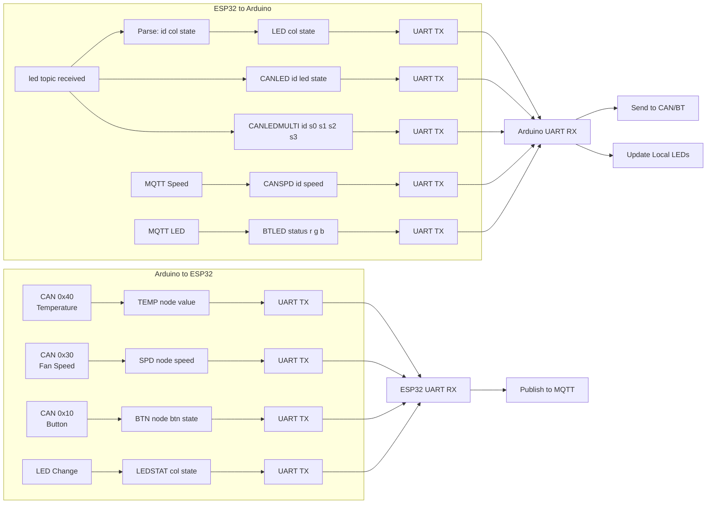

---

# 1. Purpose

This document defines how the **Arduino Uno** and **FireBeetle ESP32** communicate using UART.

This protocol is used to:

- Send sensor data from Arduino to ESP32
- Send control commands from ESP32 to Arduino
- Synchronise LED states
- Enable debugging and testing

---

# 2. Hardware Connection

- Arduino TX → Voltage Divider → ESP32 RX  
- ESP32 TX → Arduino RX  
- Arduino GND → ESP32 GND  

### Important

- Arduino = 5V logic  
- ESP32 = 3.3V logic  
- Voltage divider is REQUIRED  

---

# 3. Protocol Style

- Plain text messages  
- Space-separated fields  
- Each message ends with `\n`  

### General Format
<TYPE> <ARG1> <ARG2> <ARG3>

---

# 4. Arduino → ESP32 Messages

### Temperature

Format:
TEMP <nodeID> <temperature>

Example:

TEMP 3 23.5

---

### Speed

Format:
SPD <nodeID> <speed>

Example:
SPD 5 120

---

### Button

Format:
BTN <nodeID> <buttonID> <state>

Examples:
BTN 2 3 PRESSED
BTN 2 3 RELEASED

---

### LED Status (for sync)

Format:
LEDSTAT <colour> <state>

Examples:
LEDSTAT RED ON
LEDSTAT GREEN OFF
LEDSTAT BLUE ON

---

### Status (optional)

Format:

STATUS <system> <state>

Examples:

STATUS CAN OK
STATUS BT LOST

---

# 5. ESP32 → Arduino Messages

### LED Control

Format:

LED <colour> <state>

Examples:

LED RED ON
LED GREEN OFF
LED BLUE ON

---

### CAN Single LED

Format:
CANLED <targetID> <ledID> <state>

Example:
CANLED 12 0 ON

---

### CAN Multiple LED

Format:
CANLEDMULTI <targetID> <s0> <s1> <s2> <s3>

Example:
CANLEDMULTI 12 1 0 1 1

---

### CAN Speed

Format:
CANSPD <targetID> <speed>

Example:
CANSPD 12 250

---

### Bluetooth LED

Format:
BTLED <status> <r> <g> <b>

Examples:
BTLED 1 255 0 0
BTLED 0 0 255 0

---

# 6. Protocol Rules

- Messages must end with newline `\n`
- Fields separated by single spaces
- First token = message type
- Unknown messages must be ignored
- Invalid values must be ignored safely
- No blocking waits
- No crashes on bad input

---

# 7. Parsing Strategy

### Arduino

- Read until newline  
- Split string by spaces  
- Check first token  
- Call handler  

### ESP32

- Read full line  
- Split into tokens  
- Route based on message type  
- Publish or act accordingly  

---

# 8. Example Data Flows

### CAN → MQTT

1. Arduino receives CAN (0x40)  
2. Arduino decodes temperature  
3. Arduino sends:

TEMP 3 23.5

4. ESP32 publishes:

/student/<id>/temperature
3 23.5

---

### MQTT → LED

1. ESP32 receives:

135 red ON

2. ESP32 sends:

LED RED ON

3. Arduino updates LED  

---

### MQTT → CAN

1. ESP32 sends:

CANSPD 12 250

2. Arduino sends CAN (0x31)  
3. Target node updates speed  

---

# 9. Minimum Required Messages

### Arduino → ESP32

- `TEMP <nodeID> <temperature>`
- `SPD <nodeID> <speed>`
- `BTN <nodeID> <buttonID> <state>`
- `LEDSTAT <colour> <state>`

---

### ESP32 → Arduino
 Guide (Exact Tasks)
- `LED <colour> <state>`
- `CANLED <targetID> <ledID> <state>`
- `CANLEDMULTI <targetID> <s0> <s1> <s2> <s3>`
- `CANSPD <targetID> <speed>`
- `BTLED <status> <r> <g> <b>`

---

# 10. Validation Rules

### Arduino

- Colour must be RED / GREEN / BLUE  
- State must be ON / OFF  
- Numeric values must be valid  
- RGB must be 0–255  

### ESP32

- Correct number of arguments  
- Valid IDs  
- Valid states  
- Ignore malformed input  

---

# 11. Debugging (Recommended)

### Arduino output:

TX ESP: TEMP 3 23.5
RX ESP: LED RED ON

### ESP32 output:

RX UNO: BTN 2 3 PRESSED
TX UNO: LED GREEN OFF

---

# 12. Final Checklist

- [x] UART wired correctly  
- [ ] Voltage divider installed  
- [x] Common ground connected  
- [x] Arduino → ESP32 communication works  
- [x] ESP32 → Arduino communication works  
- [x] Messages end with newline  
- [x] Parsing works for all message types  
- [x] Invalid messages ignored safely  
- [x] No blocking serial code  

---

# 14. Proposed Work Out

---
# 13. Summary

This UART protocol is:

- Simple  
- Human-readable  
- Easy to debug  
- Fully compatible with assignment requirements  

It provides a reliable bridge between Arduino (hardware + CAN + Bluetooth) and ESP32 (MQTT + network).

---
