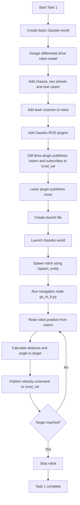

## 1. World + Robot Setup (2 Marks)
Full Marks Requirements:
World1 correctly recreated in Gazebo
Walls properly scaled and enclosed
Robot created and placed at Point A
Laser scanner mounted visibly on top
Evidence:
Screenshot of Gazebo world
Screenshot of robot in world
## 2. Integration of Gazebo with ROS (5 Marks)
Full Marks Requirements:
Robot spawns using ROS 2 launch file
/cmd_vel topic controls movement
/scan topic publishes data
No runtime errors
Evidence:
ros2 topic list
ros2 topic echo /scan
Robot moving via ROS command

HIGH VALUE SECTION – MUST WORK CLEANLY

## 3. Navigation A → B (8 Marks)
Full Marks Requirements:
Robot reaches Point B
Movement is controlled and logical
Code is readable and structured
Acceptable:
Timed movement
Simple directional control
NOT required:
Collision avoidance
## 4. Keynotes & how it works

