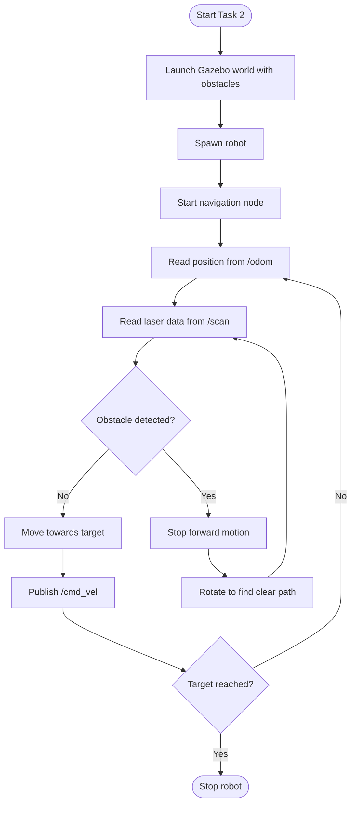

## 1. Modified World (5 Marks)
Full Marks Requirements:
World2 recreated
Internal walls added
Navigation space preserved
## 2. Navigation to Point C (5 Marks)
Full Marks Requirements:
Robot reaches Point C
Uses laser scan data
## 3. Navigation to Point D (5 Marks)
Full Marks Requirements:
Robot dynamically avoids obstacles
Behaviour adapts to environment
## 4. Final Navigation to Point B (5 Marks)
Full Marks Requirements:
Robot completes A → C → D → B
Continuous decision-making
No hard-coded path
## 5. Keynotes & how it works

