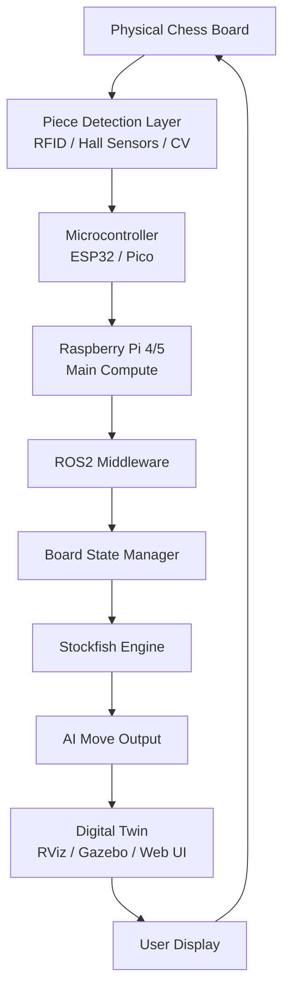
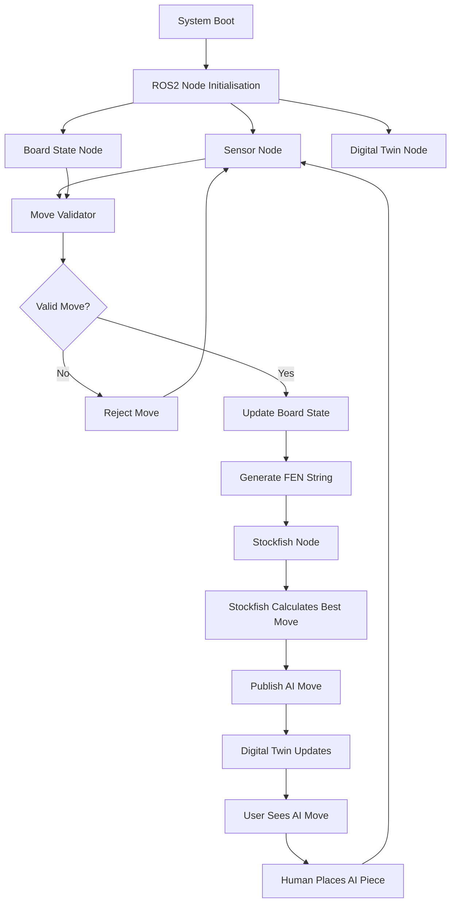
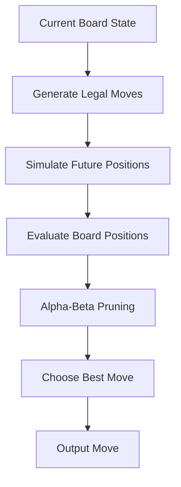

# Modular Robotic Chess System with Digital Twin

## The overall idea for this project is to create a modular robotic chess system that combines:

* Embedded systems
* ROS2
* AI/chess engines
* 3D printing
* Digital twins
* Simulation
* Eventually robotics/mechanical movement

At the moment this is still early planning/prototyping ideas, but the main goal is to build a physical chess board that can detect player moves and sync them into a digital system in real time.

The long-term idea would eventually be to allow the AI to physically move its own pieces, but realistically Phase 1 would focus more on the smart board + digital twin side first.

---

# Main Idea

## The system would work something like this:

1. Human moves a piece physically on the board
2. Sensors detect the move
3. Board state gets updated in ROS2
4. Stockfish calculates the AI move
5. Digital twin updates in RViz/Gazebo or a custom UI
6. Eventually a robotic system could physically move the AI pieces

The idea is to keep everything modular so different teams/members can work on separate parts at the same time.

---

# Why This Would Be a Good Society Project

One of the main reasons this could work well as a society project is because it naturally splits into multiple areas.

| Area             | Possible Responsibilities  |
| ---------------- | -------------------------- |
| CAD Team         | Board + piece design       |
| Electronics Team | RFID/sensors/wiring        |
| Embedded Team    | ESP32/Pico programming     |
| ROS2 Team        | Middleware + communication |
| Simulation Team  | Gazebo/RViz digital twin   |
| AI Team          | Stockfish integration      |
| UI Team          | Web dashboard/game display |
| Mechanical Team  | Future robotic movement    |

This also makes it easier for newer members to contribute without needing to understand the entire system.

---

# Initial Hardware Ideas

## Main Compute Options

| Device            | Purpose             | Notes                            |
| ----------------- | ------------------- | -------------------------------- |
| Raspberry Pi 4/5  | Main controller     | Probably the best option overall |
| Jetson Nano       | Computer vision/AI  | Probably not needed for Phase 1  |
| Raspberry Pi Pico | Sensor controller   | Good for peripheral control      |
| ESP32             | Sensor + networking | Cheap and flexible               |

---

# Piece Detection Ideas

At the moment the RFID idea is mainly for prototyping until a better long-term system is decided.

---

# Sensor Comparison

| Method          | Advantages          | Disadvantages         | Difficulty |
| --------------- | ------------------- | --------------------- | ---------- |
| RFID            | Easy identification | Expensive scaling     | Medium     |
| Hall Sensors    | Cheap + reliable    | Harder piece tracking | Low        |
| Computer Vision | Minimal hardware    | Complex software      | High       |

---

# Option 1 — RFID System

## Idea

Each chess piece would contain a small RFID tag.

## Underneath the board would either be:

* one RFID reader per square
* or some kind of multiplexed/shared system

## The system would then know:

* which piece is present
* where it is located

---

## Advantages

* Easy to prototype
* Reliable identification
* Good educational value
* Easier software logic

---

## Disadvantages

* 64 readers becomes complicated
* Wiring could become messy
* Possible interference between readers
* Scaling cost increases quickly

---

# Option 2 — Hall Effect / Magnetic Sensors

Instead of RFID, magnets inside pieces could trigger sensors below the board.

---

## Advantages

* Much cheaper
* Easier scaling
* Common in smart chessboards
* Simpler hardware

---

## Disadvantages

* Harder to identify exact piece type
* Might still need additional tracking

---

# Option 3 — Computer Vision

## A camera above the board could track pieces using:

* OpenCV
* ArUco markers
* YOLO/object detection

---

## Advantages

* Minimal board electronics
* Easier board construction
* Very scalable
* Visually impressive

---

## Disadvantages

* Much harder software
* Lighting/calibration issues
* Higher processing requirements

---

# Recommended Starting Point

## At the moment the best approach is probably:

* RFID or Hall sensors for prototyping
* Raspberry Pi 5 as main compute
* ROS2 middleware
* Stockfish for AI
* Simple 2D UI or RViz digital twin first

## Then later move into:

* Gazebo
* Computer vision
* Robotic movement
* Advanced UI systems

---

# Overall Hardware Architecture

---

# Software Architecture

---

# Stockfish

## What is Stockfish?

Stockfish is an open-source chess engine and is probably the best option for this project.

It is NOT a Large Language Model.

Instead of generating text, Stockfish is specifically designed to calculate chess moves extremely efficiently.

---

# How Stockfish Works

| Step                    | What Happens                                        |
| ----------------------- | --------------------------------------------------- |
| **Input**               | Receives board position as a FEN string             |
| **Move generation**     | Generates all legal moves from the current position |
| **Alpha-Beta Pruning**  | Removes unnecessary search branches                 |
| **NNUE Evaluation**     | Scores board positions using a neural network       |
| **Iterative Deepening** | Searches deeper until time limit                    |
| **Output**              | Returns best move in UCI format                     |

---

## It can:

* Generate legal moves
* Evaluate board positions
* Predict future moves
* Calculate the strongest possible move

It also runs very well on low-power hardware like a Raspberry Pi 4/5.

---

# Simplified Stockfish Flow

---

# Stockfish vs LLM

## Stockfish is purpose-built for chess and gives major advantages:

| Stockfish             | LLM               |
| --------------------- | ----------------- |
| Designed for chess    | Designed for text |
| Extremely fast        | Much slower       |
| Reliable/legal moves  | Can hallucinate   |
| Runs locally          | Often cloud-based |
| Adjustable difficulty | Harder to control |

## An LLM could still possibly be useful later for:

* commentary
* coaching
* tutorials
* voice interaction

---

# ROS2 Integration (if we go this route)

## ROS2 would basically act as the middleware between everything.

## Allows for:

* Modular nodes
* Scalable architecture
* Simulation support
* Easier debugging
* Distributed systems later

---

# Example ROS2 Topics

| Topic         | Purpose                 |
| ------------- | ----------------------- |
| /board_state  | Current board layout    |
| /player_move  | Human move              |
| /ai_move      | AI-generated move       |
| /digital_twin | Visual updates          |
| /robot_goal   | Future robotic movement |

---

# Digital Twin / Simulation Options

| Option    | Complexity | Best For                     |
| --------- | ---------- | ---------------------------- |
| 2D Web UI | Low        | Simple demos + browser use   |
| RViz      | Medium     | ROS2 visualisation/debugging |
| Gazebo    | High       | Full simulation + robotics   |

---

# RViz

## Advantages

* Lightweight
* ROS-native
* Easier setup
* Good for debugging
* Real-time visualization
* Quick iteration cycles

## Disadvantages

* Limited physics simulation
* 2D visualization primarily
* Not suitable for complex robotics testing
* Less realistic visuals than Gazebo
* Limited environmental interaction modeling

---

# Gazebo

## Advantages

* Full simulation
* Physics support
* Better robotics testing
* More realistic visuals
* Complex environmental scenarios
* Accurate dynamics modeling

## Disadvantages

* More difficult setup
* Higher performance requirements
* More complex integration
* Steeper learning curve
* Slower iteration compared to RViz

---

# ROS2 

## Advantages

* Modular node architecture
* Middleware for easy component communication
* Scalable system design
* Native support for both RViz and Gazebo
* Distributed system capabilities
* Strong ecosystem for robotics
* Excellent debugging tools

## Disadvantages

* Steeper learning curve for beginners
* More complex initial setup
* Added computational overhead
* Requires understanding pub/sub messaging
* Overkill for very simple systems
* More dependencies to manage
* Debugging distributed systems is harder

---

# Recommended Development Phases

# Phase 1 — Smart Board + Digital Twin

## Main focus:

* Board sensing
* ROS2 communication
* Stockfish integration
* 2D UI or RViz

---

# Phase 2 — Improved Simulation

## Main focus:

* Better digital twin
* Gazebo integration
* Better UI
* LED feedback
* More polished system

---

# Phase 3 — Robotic Movement

This is probably where the hardest part of the project comes in.

## Main focus:

* Motion planning
* Piece movement
* Captures
* Calibration
* Collision avoidance

## Possible systems:

* XY gantry
* Robot arm
* Magnetic under-board system

---

# Overall Risks

| Risk                     | Mitigation                |
| ------------------------ | ------------------------- |
| RFID complexity          | Modular board sections    |
| Wiring issues            | PCB design later          |
| ROS2 learning curve      | Start simple              |
| Board desync             | Add full-board rescan     |
| Scope becoming too large | Strict phased development |

---

# Possible Future Features

* LED move highlighting
* Voice assistant
* AI/tts commentary
* Online play support
* Difficulty selector
* Tournament mode

---
